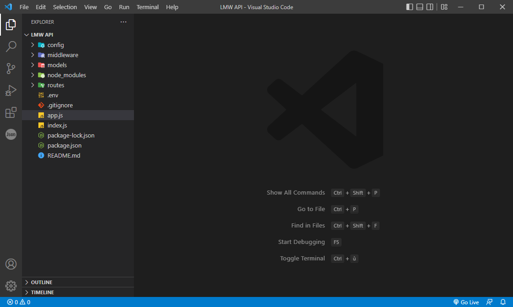

# LMW API

> A REST API to manage the data of Lathe Mill Workshop

<p align="center">
  <a href="#about-the-project">About The Project</a> •
  <a href="#installation">Installation</a> •
  <a href="#how-to-use">How To Use</a> •
  <a href="#license">License</a>
</p>

## About The Project

An application programming interface that adheres to the constraints of REST architectural style and enables interaction with RESTful web services



## Installation

To clone and run this application, you'll need [Git](https://git-scm.com) and [Node.js](https://nodejs.org/en/download/) (which comes with [npm](http://npmjs.com)) installed on your computer. Also you'll need download [MongoDB](https://www.mongodb.com/try/download/community) document-oriented database on your computer.

From your command line:

- Clone this repository

```bash
git clone https://github.com/hassenmaoua/LMW-API
```

- Go into the repository

```bash
cd LMW-API
```

- Initialize project

```bash
npm init -y
```

- Install Dependencies

```bash
npm install express mongoose nodemon jsonwebtoken
```

> `express` : [Express](https://expressjs.com/) is a minimal and flexible Node.js web application framework that provides a robust set of features for web and mobile applications.

> `mongoose` : [Mongoose](https://mongoosejs.com/) is a Node. js-based Object Data Modeling (ODM) library for MongoDB.

> `nodemon` : [Nodemon](https://www.npmjs.com/package/nodemon) is for restarting automatically the application when file changes in the directory are detected.

> `jsonwebtoken` : [JSON Web Token](https://www.npmjs.com/package/jsonwebtoken) is an open standard for securely transferring data within parties using a JSON object.

## How To Use

Here are the instructions for setting up your project locally..
To get a local running you may follow these simple steps.

1. Install Environment Variables and create `.env` file
   ```bash
   npm i --save-dev dotenv
   ```
2. Create this variables inside `.env`
   ```bash
   MONGO_URI=mongodb://127.0.0.1/{Your DataBase Name}
   API_PORT={Any Number}
   TOKEN_KEY={Random String}
   ```
3. Inside `package.json` Change `"scripts"` to
   ```json
    "scripts": {
        "start": "node index.js",
        "dev": "nodemon index.js"
    }
   ```
4. Start Server Application
   ```bash
   node index.js
   ```

## License

Hassen Maoua

---

> LinkedIn [Hassen Maoua](https://linkedin.com/in/hassen-maoua-215683251) &nbsp;&middot;&nbsp;
> GitHub [@hassenmaoua](https://github.com/hassenmaoua) &nbsp;&middot;&nbsp;
> Gmail [hassenmaoua07@gmail.com](https://mail.google.com/mail/?view=cm&fs=1&to=hassenmaoua07@gmail.com&su=About+LMW+API)
> Facebook [@hassen-maoua](https://facebook.com/hassen.maoua)
